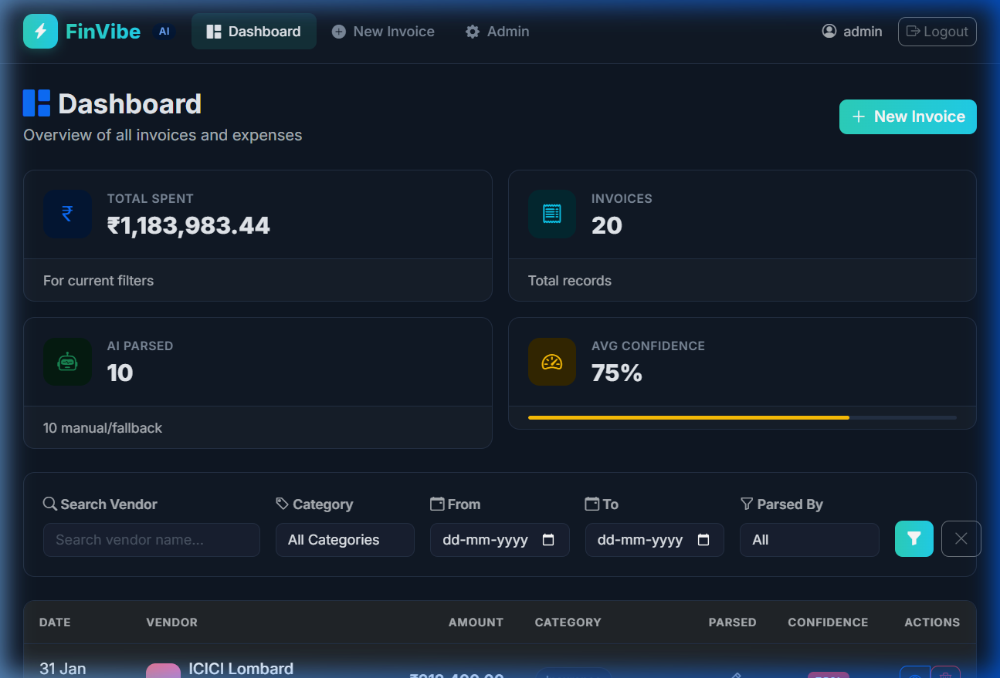

<div align="center">

# ⚡ FinVibe — AI-Powered Invoice Intelligence System

**Intelligent invoice parsing with Gemini AI integration, deterministic fallback engine, audit trails, and production-grade security hardening.**

[](https://python.org)
[](https://djangoproject.com)
[](https://ai.google.dev)
[](#-testing)
[](LICENSE)



</div>

---

## 📋 Overview

FinVibe is a **production-ready AI invoice processing system** built with Django 4.2 and Google Gemini API. It automates invoice data extraction from raw text, provides confidence scoring, maintains full audit trails, and includes enterprise-grade security measures.

**Core Flow:** Admin pastes raw invoice text → AI extracts vendor, amount, date, category → Confidence scored → Stored with audit trail → Dashboard visualization.

---

## ✨ Key Features

| Feature | Description |
|---------|-------------|
| 🤖 **AI Parsing (Gemini)** | Extracts vendor, amount, date, category with confidence scores using Google Gemini API |
| 🔄 **Fallback Engine** | Deterministic regex + heuristic parser kicks in when AI fails or confidence is low |
| 📊 **Confidence Scoring** | Color-coded badges (green/yellow/red) with per-field confidence tracking |
| 📝 **Audit Trail** | Immutable log of every action — create, parse, edit, accept, reject, delete |
| 🎭 **Demo Mode** | Zero-cost demo parsing using fallback engine — safe for staging/public demos |
| 🛡️ **Security Hardening** | Rate limiting, PII-safe logging, HSTS, input guards, API key masking |
| 🎨 **Dark Dashboard** | Glassmorphism UI with teal/coral palette, KPI cards, micro-animations |
| ✅ **108 Automated Tests** | Models, AI service, fallback parser, views, security middleware |

---

## 🏗️ Architecture

```
┌─────────────────────────────────────────────────────────┐
│                    Django Application                    │
│                                                         │
│  ┌──────────┐  ┌──────────────────┐  ┌───────────────┐ │
│  │  Views &  │  │  Rate Limit      │  │  Audit Log    │ │
│  │  API      │──│  Middleware       │  │  System       │ │
│  └────┬─────┘  └──────────────────┘  └───────────────┘ │
│       │                                                 │
│  ┌────▼──────────────────────────────────────────────┐  │
│  │           Invoice Processor (Orchestrator)         │  │
│  │                                                    │  │
│  │  ┌─────────────┐    ┌──────────────────────────┐  │  │
│  │  │ AI Service   │    │ Fallback Parser          │  │  │
│  │  │ (Gemini API) │───▶│ (Regex + Heuristics)     │  │  │
│  │  │ • Retries    │    │ • Amount: ₹/$            │  │  │
│  │  │ • Rate limit │    │ • Date: 6 formats        │  │  │
│  │  │ • JSON parse │    │ • Vendor: keyword match  │  │  │
│  │  └─────────────┘    │ • Category: 13 classes    │  │  │
│  │                      └──────────────────────────┘  │  │
│  └────────────────────────────────────────────────────┘  │
│                                                         │
│  ┌──────────────────┐  ┌──────────────────────────────┐ │
│  │ PII-Safe Logging  │  │ Sentry (PII stripped)       │ │
│  │ • SHA-256 hashing │  │ • before_send filter        │ │
│  │ • IP masking      │  │ • No raw_text in reports    │ │
│  └──────────────────┘  └──────────────────────────────┘ │
└─────────────────────────────────────────────────────────┘
```

### Service Layer

| Component | File | Responsibility |
|-----------|------|----------------|
| **AI Service** | `invoices/services/ai_service.py` | Gemini API calls with exponential backoff, rate limiting, JSON extraction |
| **Fallback Parser** | `invoices/services/fallback_parser.py` | Deterministic extraction using regex for amounts, dates, vendors, categories |
| **Invoice Processor** | `invoices/services/invoice_processor.py` | Orchestrates AI → fallback chain, atomic saves, audit logging |
| **Rate Limiter** | `invoices/middleware.py` | Per-IP sliding window rate limiting (general + parse-specific) |
| **Demo Mode** | `ai_service._demo_mode_response()` | Zero-cost parsing using fallback engine for demos |

---

## 🔒 Security Highlights

| Measure | Implementation |
|---------|---------------|
| **API Key Protection** | Environment variables only; `mask_api_key()` for logging; never in frontend |
| **PII-Safe Logging** | `hash_text_for_log()` — SHA-256 hashes replace raw text in all logs |
| **Rate Limiting** | Per-IP sliding window: 30 req/min general, 5 req/min parse endpoints |
| **Input Guards** | `MAX_RAW_TEXT_LENGTH=50000` enforced at service + API layer |
| **Sentry PII Filter** | `before_send` hook strips `raw_text` from error reports |
| **Session Security** | HttpOnly, SameSite=Lax, 30-min timeout, expire on browser close |
| **HTTPS/HSTS** | SSL redirect, HSTS 1 year with preload and subdomains |
| **DB Security** | PostgreSQL with SSL connections in production |
| **CSRF Protection** | Django CSRF middleware + meta tag for AJAX |

---

## 🚀 Quick Start

### Prerequisites

- Python 3.11+
- pip
- Git

### Installation

```bash
# Clone the repository
git clone https://github.com/Mayuresh7482/FinVibe-AI-Invoice-Intelligence.git
cd FinVibe-AI-Invoice-Intelligence

# Create virtual environment
python -m venv venv

# Activate (Windows)
.\venv\Scripts\activate
# Activate (macOS/Linux)
source venv/bin/activate

# Install dependencies
pip install -r requirements.txt

# Configure environment
cp .env.example .env
# Edit .env → add your GEMINI_API_KEY (or leave DEMO_MODE=True)

# Run migrations
python manage.py migrate

# Create admin user
python manage.py createsuperuser

# Seed sample data (optional)
python manage.py seed_invoices --count 20

# Start development server
python manage.py runserver
```

Visit `http://localhost:8000` — login with your admin credentials.

### Demo Mode (No API Key Needed)

Set `DEMO_MODE=True` in `.env` to use the fallback parser for all parsing operations. This is the **safe default** — no Gemini API calls, zero cost. The demo popup on the dashboard also uses this mode.

---

## 🧪 Testing

```bash
# Run all 108 tests
python manage.py test invoices.tests -v 2

# Run specific test suite
python manage.py test invoices.tests.test_security -v 2
python manage.py test invoices.tests.test_ai_service -v 2
python manage.py test invoices.tests.test_fallback_parser -v 2
python manage.py test invoices.tests.test_models -v 2
python manage.py test invoices.tests.test_views -v 2
```

### Test Coverage

| Suite | Tests | Coverage |
|-------|:-----:|----------|
| `test_models.py` | 12 | Model creation, hashing, confidence levels, ordering |
| `test_ai_service.py` | 14 | Amount/category normalization, JSON extraction, mocked Gemini |
| `test_fallback_parser.py` | 21 | Amount (₹/$/Rs), dates (6 formats), vendor, category extraction |
| `test_views.py` | 12 | Dashboard, CRUD, auth, pagination, HTTP methods |
| `test_security.py` | 49 | Rate limiting, IP masking, PII hashing, demo mode, input guards |
| **Total** | **108** | **All passing ✅** |

---

## 🏭 Production Deployment

### Environment Setup

```bash
# 1. Set production settings
export DJANGO_SETTINGS_MODULE=finvibe.settings.production
export DEBUG=False
export DEMO_MODE=False

# 2. Generate a strong secret key
python -c "from django.core.management.utils import get_random_secret_key; print(get_random_secret_key())"

# 3. Store GEMINI_API_KEY in secret manager
# AWS: aws secretsmanager create-secret --name finvibe/GEMINI_API_KEY --secret-string "..."
# GCP: echo -n "..." | gcloud secrets create GEMINI_API_KEY --data-file=-

# 4. Configure PostgreSQL
export DB_NAME=finvibe_db DB_USER=finvibe_user DB_PASSWORD=<secure-password> DB_HOST=<host>

# 5. Collect static files & migrate
python manage.py collectstatic --noinput
python manage.py migrate

# 6. Run with Gunicorn
gunicorn finvibe.wsgi:application --bind 0.0.0.0:8000 --workers 3
```

### Production Checklist

- [ ] `DEBUG=False`
- [ ] `DEMO_MODE=False` (production.py enforces this)
- [ ] Strong `SECRET_KEY` (not default)
- [ ] `GEMINI_API_KEY` in secret manager
- [ ] PostgreSQL configured with SSL
- [ ] HTTPS with valid TLS certificate
- [ ] `SENTRY_DSN` configured
- [ ] Budget alerts on Gemini API dashboard
- [ ] `collectstatic` run
- [ ] Gunicorn + Nginx reverse proxy

---

## 📂 Project Structure

```
FinVibe-AI-Invoice-Intelligence/
│
├── finvibe/                          # Django project config
│   ├── settings/
│   │   ├── __init__.py               # Auto-selects local/production
│   │   ├── base.py                   # Shared settings + security config
│   │   ├── local.py                  # Dev: SQLite, DEBUG=True
│   │   └── production.py             # Prod: PostgreSQL, HTTPS, Sentry
│   ├── urls.py                       # Root URLs + /healthz endpoint
│   └── wsgi.py
│
├── invoices/                         # Main application
│   ├── models.py                     # Invoice + AuditLog models
│   ├── views.py                      # Dashboard, CRUD, API endpoints
│   ├── urls.py                       # 10 URL patterns
│   ├── forms.py                      # Create/edit + search forms
│   ├── admin.py                      # Custom admin with AI parsing
│   ├── middleware.py                 # Rate limiting + PII-safe utilities
│   │
│   ├── services/
│   │   ├── ai_service.py             # Gemini API connector + demo mode
│   │   ├── fallback_parser.py        # Regex + heuristic parser
│   │   └── invoice_processor.py      # Orchestrator: AI → fallback chain
│   │
│   ├── templates/invoices/
│   │   ├── base.html                 # Dark theme layout
│   │   ├── dashboard.html            # KPI cards + invoice table
│   │   ├── invoice_detail.html       # Edit + metadata + audit trail
│   │   ├── invoice_form.html         # Create/edit form
│   │   └── partials/
│   │       └── demo_modal.html       # Interactive demo popup
│   │
│   ├── static/invoices/
│   │   ├── css/dashboard.css         # Teal/coral glassmorphism theme
│   │   └── js/dashboard.js           # Animations, shortcuts, interactions
│   │
│   ├── templatetags/
│   │   └── invoice_tags.py           # Confidence badges, currency formatting
│   │
│   ├── management/commands/
│   │   └── seed_invoices.py          # 10 realistic sample invoices
│   │
│   └── tests/
│       ├── test_models.py
│       ├── test_ai_service.py
│       ├── test_fallback_parser.py
│       ├── test_views.py
│       └── test_security.py
│
├── manage.py
├── requirements.txt
├── pyproject.toml                    # pytest + black + isort config
├── .env.example                      # Environment template
├── .gitignore
└── README.md
```

---

## 🗺️ Roadmap

- [ ] 📸 OCR for image/scanned invoice PDFs (Tesseract + pdf2image)
- [ ] ⚡ Background task queue (Celery + Redis)
- [ ] 👥 Multi-user RBAC roles (Admin, Auditor, Viewer)
- [ ] 📤 Invoice export (PDF/CSV/Excel)
- [ ] 📈 Dashboard analytics charts (Chart.js / D3.js)
- [ ] 🐳 Docker + Docker Compose setup
- [ ] 🔄 GitHub Actions CI/CD pipeline
- [ ] 🌐 REST API with token authentication

---

## 🛠️ Tech Stack

| Layer | Technology |
|-------|-----------|
| **Backend** | Django 4.2, Python 3.11+ |
| **AI Engine** | Google Gemini API (gemini-1.5-flash) |
| **Database** | SQLite (dev) / PostgreSQL (prod) |
| **Frontend** | Bootstrap 5.3, Bootstrap Icons, custom CSS |
| **Security** | Django middleware, Sentry SDK, WhiteNoise |
| **Testing** | Django TestCase, unittest.mock |

---

## 👤 Author

**Mayuresh Borate**
Full Stack Engineer & Python Developer

---

## 📄 License

This project is licensed under the MIT License — see the [LICENSE](LICENSE) file for details.
